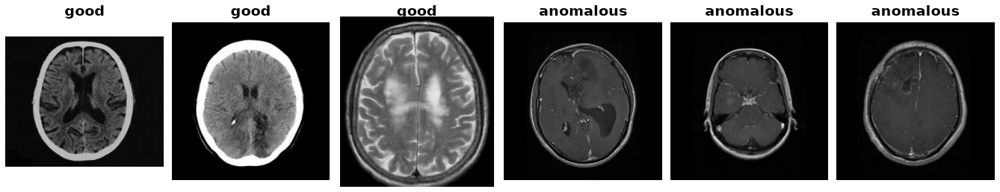

MedIAnomaly
===========

.. raw:: html

   

   
   
   
   
   

Overview
--------

MedIAnomaly benchmarks anomaly detection across seven medical imaging datasets spanning
chest radiographs, brain MRI, retinal fundus images, histopathology and dermoscopy. Each
subset follows the one-class protocol: the train split holds only normal images, and the
test split mixes normal and abnormal ones.

Subsets
-------

Six subsets are redistributed pre-processed on `Zenodo record 12677223
<https://zenodo.org/records/12677223>`_ with published MD5 digests, which the builder
verifies on download.

.. list-table::
   :header-rows: 1
   :widths: 22 16 12 12 12 26

   * - Subset
     - Download
     - Train
     - Test (normal)
     - Test (abnormal)
     - Modality
   * - ``BrainTumor``
     - 0.04 GB
     - 1,000
     - 600
     - 600
     - Brain MRI
   * - ``BraTS2021``
     - 0.07 GB
     - 4,211
     - 828
     - 1,948
     - Brain MRI
   * - ``LAG``
     - 0.20 GB
     - 1,500
     - 811
     - 811
     - Retinal fundus
   * - ``RSNA``
     - 0.57 GB
     - 3,851
     - 1,000
     - 1,000
     - Chest radiograph
   * - ``VinCXR``
     - 0.62 GB
     - 4,000
     - 1,000
     - 1,000
     - Chest radiograph
   * - ``Camelyon16``
     - 0.89 GB
     - 5,088
     - 1,120
     - 1,113
     - Histopathology
   * - ``ISIC2018_Task3``
     - *gated*
     - —
     - —
     - —
     - Dermoscopy

``config_name="all"`` totals 19,650 train and 11,831 test rows.

``config_name="all"`` (the default) covers the six Zenodo subsets.

ISIC2018_Task3 requires manual setup
------------------------------------

``ISIC2018_Task3`` is **not** part of the Zenodo bundle. It is gated behind an ISIC
challenge account and terms agreement, so it must be supplied via ``data_dir=``:

.. code-block:: text

    <data_dir>/ISIC2018_Task3/
        ISIC2018_Task3_Training_Input/
        ISIC2018_Task3_Training_GroundTruth/
        ISIC2018_Task3_Test_Input/
        ISIC2018_Task3_Test_GroundTruth/

.. code-block:: python

    ds = MedIAnomaly(split="train", config_name="ISIC2018_Task3", data_dir="/path/to/data")

Loading it without ``data_dir`` raises a ``ValueError`` carrying these instructions.

Data Structure
--------------

.. list-table::
   :header-rows: 1
   :widths: 20 25 55

   * - Key
     - Type
     - Description
   * - ``image``
     - ``PIL.Image.Image``
     - The medical image
   * - ``label``
     - int
     - ``0`` = normal, ``1`` = abnormal
   * - ``subset``
     - int
     - Index into the seven subsets
   * - ``image_path``
     - str
     - Path relative to the subset root

Usage Example
-------------

.. code-block:: python

    from stable_datasets.images import MedIAnomaly

    train = MedIAnomaly(split="train", config_name="BrainTumor")
    test = MedIAnomaly(split="test", config_name="BrainTumor")

    print(len(train), len(test))  # 1000 1200

    # Train is normal-only under the one-class protocol
    assert {train[i]["label"] for i in range(len(train))} == {0}

    # All six Zenodo subsets
    all_train = MedIAnomaly(split="train", config_name="all")

References
----------

- Official repository: https://github.com/caiyu6666/MedIAnomaly
- Pre-processed data: https://zenodo.org/records/12677223
- ISIC 2018 challenge data: https://challenge.isic-archive.com/data/#2018
- License: CC BY 4.0

Citation
--------

.. code-block:: bibtex

    @article{cai2024medianomaly,
      title={MedIAnomaly: A comparative study of anomaly detection in medical images},
      author={Cai, Yu and Zhang, Weiwen and Chen, Hao and Cheng, Kwang-Ting},
      journal={arXiv preprint arXiv:2404.04518},
      year={2024}
    }
