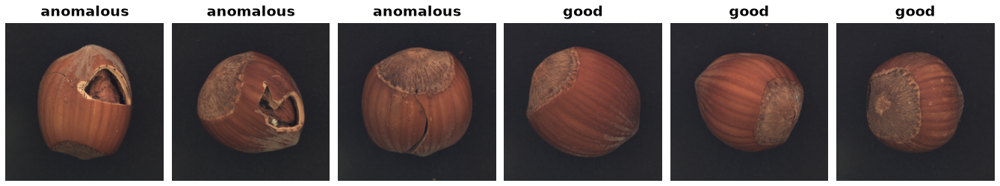

MVTec-AD
========

.. raw:: html

   

   
   
   
   
   

Overview
--------

MVTec-AD is an industrial anomaly detection benchmark of 5,354 high-resolution images
spanning 15 object and texture categories. It follows the **one-class** protocol: the
train split contains only defect-free images, while the test split mixes defect-free
images with 73 defect types, each carrying a pixel-precise ground-truth mask.

Configurations
--------------

MVTec publishes one archive per category alongside the full bundle, so selecting a
single category downloads roughly 100-800 MB instead of the 5 GB bundle.

.. list-table::
   :header-rows: 1
   :widths: 25 20 20 35

   * - ``config_name``
     - Train
     - Test
     - Notes
   * - ``"all"`` (default)
     - 3,629
     - 1,725
     - Full bundle, ~5 GB
   * - one of the 15 categories
     - varies
     - varies
     - Downloads that category's archive only

Categories: ``carpet``, ``grid``, ``leather``, ``tile``, ``wood`` (textures);
``bottle``, ``cable``, ``capsule``, ``hazelnut``, ``metal_nut``, ``pill``, ``screw``,
``toothbrush``, ``transistor``, ``zipper`` (objects).

Data Structure
--------------

.. list-table::
   :header-rows: 1
   :widths: 20 25 55

   * - Key
     - Type
     - Description
   * - ``image``
     - ``PIL.Image.Image``
     - The inspection image
   * - ``mask``
     - ``PIL.Image.Image`` or ``None``
     - Binary ground-truth mask; ``None`` for defect-free images
   * - ``label``
     - int
     - ``0`` = good, ``1`` = anomalous
   * - ``defect_type``
     - str
     - ``"good"``, or the defect name (e.g. ``"broken_large"``)
   * - ``category``
     - int
     - Index into the 15 categories
   * - ``image_path``
     - str
     - Path relative to the extracted archive root

Usage Example
-------------

.. code-block:: python

    from stable_datasets.images import MVTecAD

    # One category: downloads only that category's archive
    train = MVTecAD(split="train", config_name="toothbrush")
    test = MVTecAD(split="test", config_name="toothbrush")

    print(len(train), len(test))  # 60 42

    sample = test[0]
    if sample["label"] == 1:
        mask = sample["mask"]          # PIL.Image.Image, aligned with sample["image"]
        print(sample["defect_type"])   # e.g. "defective"

    # All 15 categories at once
    all_train = MVTecAD(split="train", config_name="all")

.. note::

   Contamination sampling (mixing a proportion of defective images into the train
   split) is deliberately **not** part of the builder. The builder stores the honest
   official split; sampling is a training-time policy for the caller to apply.

References
----------

- Official website: https://www.mvtec.com/company/research/datasets/mvtec-ad
- License: CC BY-NC-SA 4.0 (non-commercial research and educational use)

Citation
--------

.. code-block:: bibtex

    @inproceedings{bergmann2019mvtec,
      title={MVTec AD--A comprehensive real-world dataset for unsupervised anomaly detection},
      author={Bergmann, Paul and Fauser, Michael and Sattlegger, David and Steger, Carsten},
      booktitle={Proceedings of the IEEE/CVF Conference on Computer Vision and Pattern Recognition},
      pages={9592--9600},
      year={2019}
    }
