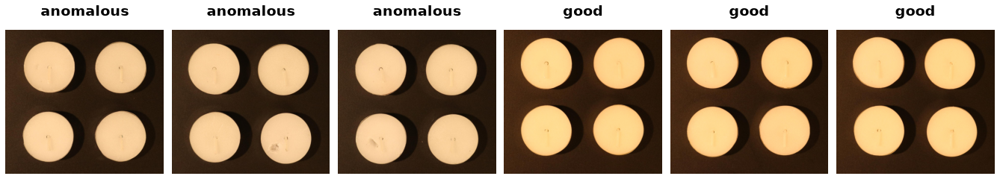

VisA
====

.. raw:: html

   

   
   
   
   
   

Overview
--------

VisA (Visual Anomaly) contains 10,821 high-resolution images across 12 objects spanning
printed circuit boards, multi-instance items and single instances. Anomalous images cover
surface and structural defects and carry pixel-level segmentation masks.

The builder follows the official **1-class** protocol: 8,659 train images (all normal)
and 2,162 test images (962 normal + 1,200 anomalous).

Sources
-------

VisA needs two downloads, because the image archive ships no split definition:

.. list-table::
   :header-rows: 1
   :widths: 25 75

   * - Asset
     - Source
   * - ``images``
     - ``VisA_20220922.tar`` (1.9 GB) from Amazon S3
   * - ``split_csv``
     - ``split_csv/1cls.csv`` from the ``amazon-science/spot-diff`` repository

Configurations
--------------

Objects: ``candle``, ``capsules``, ``cashew``, ``chewinggum``, ``fryum``, ``macaroni1``,
``macaroni2``, ``pcb1``, ``pcb2``, ``pcb3``, ``pcb4``, ``pipe_fryum``.

``config_name="all"`` (the default) covers all twelve. Because the images ship as a
single archive, a per-object config still downloads the full archive but caches only
that object's rows. Every object contributes exactly 100 anomalous test images.

Data Structure
--------------

.. list-table::
   :header-rows: 1
   :widths: 20 25 55

   * - Key
     - Type
     - Description
   * - ``image``
     - ``PIL.Image.Image``
     - The inspection image
   * - ``mask``
     - ``PIL.Image.Image`` or ``None``
     - Single-channel ground-truth **label map** (``0`` = background, a distinct
       small id per defect region); ``None`` for normal images. Note this differs
       from MVTec-AD, whose masks are binary ``0``/``255``.
   * - ``label``
     - int
     - ``0`` = good, ``1`` = anomalous
   * - ``object``
     - int
     - Index into the 12 objects
   * - ``image_path``
     - str
     - Path relative to the extracted archive root

Usage Example
-------------

.. code-block:: python

    from stable_datasets.images import VisA

    train = VisA(split="train", config_name="candle")
    test = VisA(split="test", config_name="candle")

    print(len(train), len(test))  # 900 200

    sample = test[0]
    print(sample["label"], sample["mask"])

    # All twelve objects
    all_train = VisA(split="train", config_name="all")  # 8,659 rows

References
----------

- Official repository: https://github.com/amazon-science/spot-diff
- License: CC BY 4.0

Citation
--------

.. code-block:: bibtex

    @inproceedings{zou2022spot,
      title={SPot-the-Difference Self-supervised Pre-training for Anomaly Detection and Segmentation},
      author={Zou, Yang and Jeong, Jongheon and Pei, Latha and Zhang, Xiaolong and Cheng, Wenchao and Li, Xin},
      booktitle={European Conference on Computer Vision},
      pages={392--408},
      year={2022},
      organization={Springer}
    }
